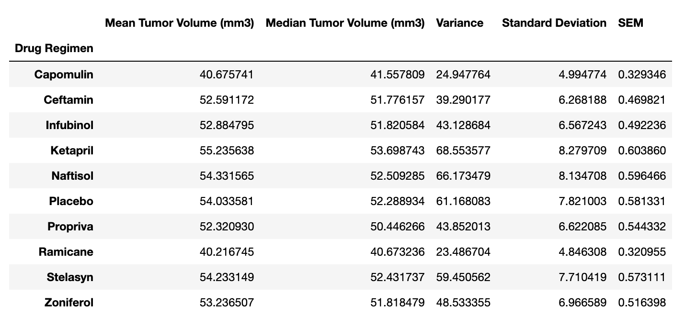
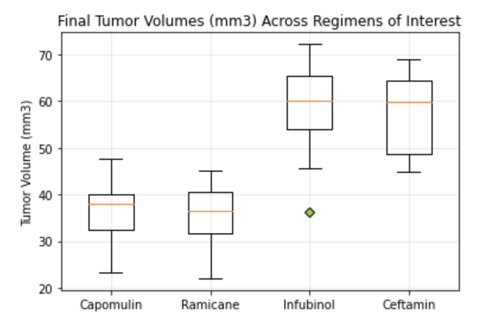

# Squamous Cell Carcinoma (SCC) Treatment Trials Analysis

This project analyzes the results of 10 different squamous cell carcinoma treatment trials using mice. After cleaning the data, I created a table of summary statistics:  

I used Matplot lib to visualize various aspects of the data and moved forward using only the four most promising treatments: 

The rest of the visualizations as well as the final analysis can be found in `Pymaceuticals/pymaceuticals_analysis.ipynb`. The source data is in the `data` directory.